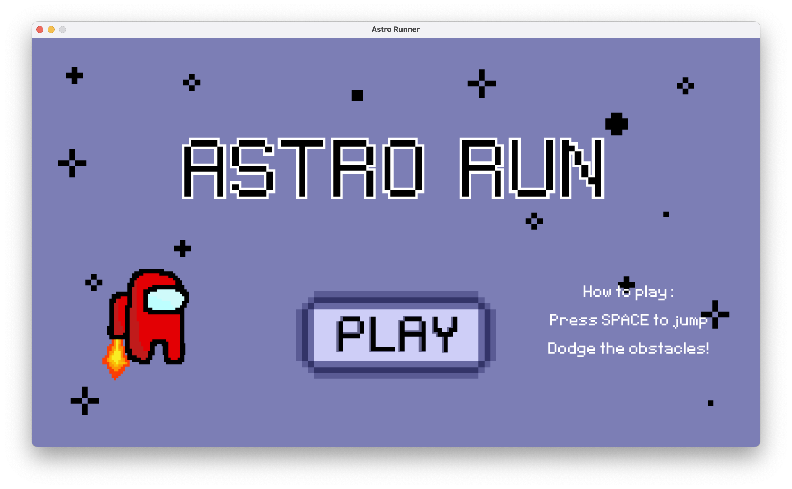
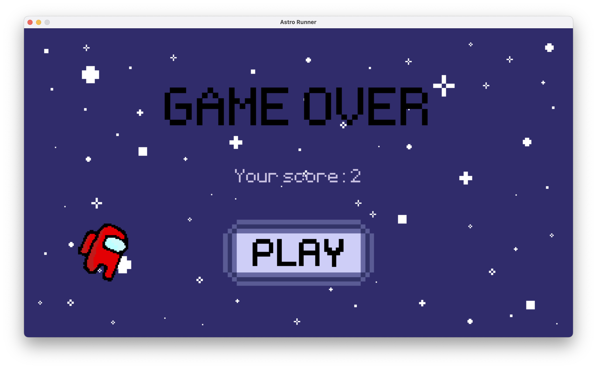

# Astro Runner

> Selena Zhou, May 2023

## Description

Astro Runner is a 2D platformer game written on PyGame.
It features a little astronaut creature trying to avoid asteroids and other space-related obstacles.

### Demo Video

https://github.com/zhouselena/AstroRun/assets/58157434/78bf5602-8df4-4333-aebd-bab9835c44c8

> Also available on YouTube at https://youtu.be/SshlwcV6xRs for better music syncing.

## Purpose

The purpose of this game is to extend my knowledge of PyGame and get more familiar with coding 2D games.
Furthermore, to practice creating graphics using visual design softwares.

## Gameplay

## Tags

**Language:** Python (Pygame)

**Topic:** Game development
