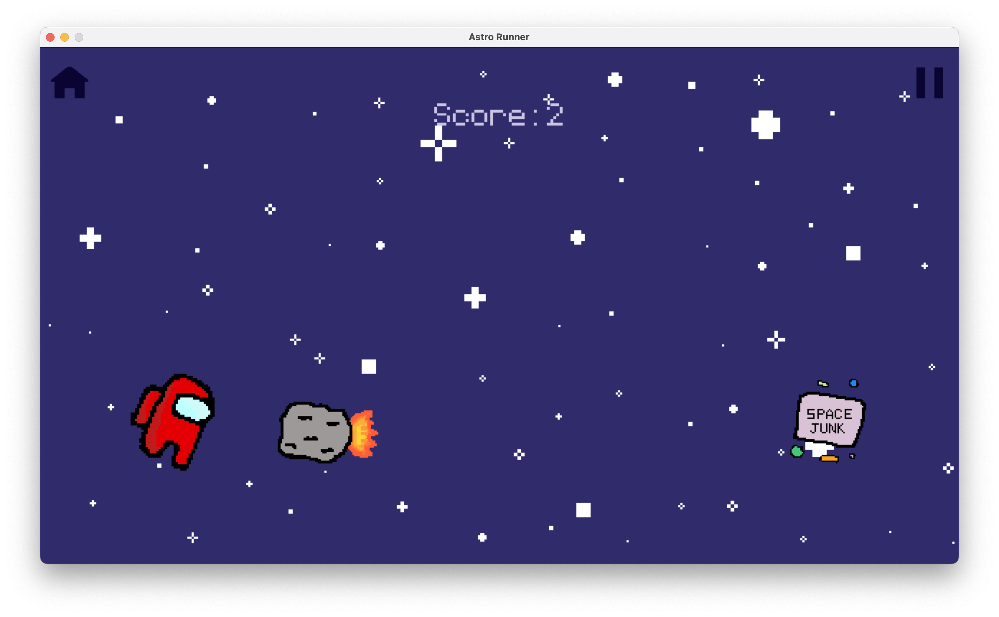

# Astro Runner

> Selena Zhou, May 2023

## Description

Astro Runner is a 2D platformer game written on PyGame.
It features a little astronaut creature trying to avoid asteroids and other space-related obstacles.

### Demo Video

https://user-images.githubusercontent.com/58157434/236994905-ffb2ff59-e6f6-4596-8f56-d1aafe882627.mov

> Also available on YouTube at [https://youtu.be/OxcauGfuwWE](https://youtu.be/RXKhX07HA6k) for better music syncing.

## Purpose

The purpose of this game is to extend my knowledge of PyGame and get more familiar with coding 2D games.
Furthermore, to practice creating graphics using visual design softwares.

## Gameplay

## Tags

**Language:** Python (Pygame)

**Topic:** Game development
