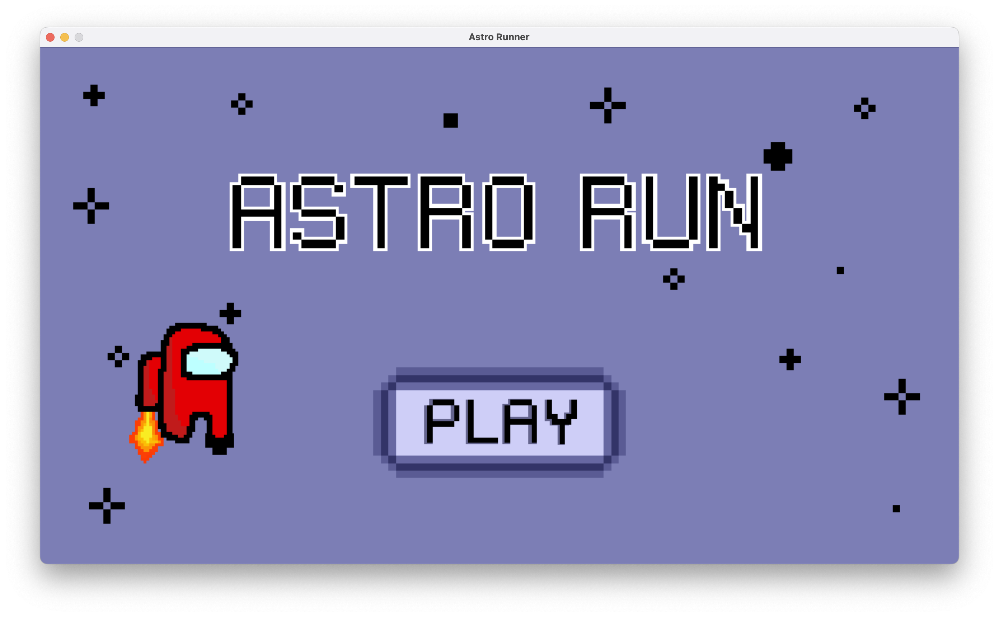

# Astro Runner

> Selena Zhou, May 2023

## Description

Astro Runner is a 2D platformer game written on PyGame.
It features a little astronaut creature trying to avoid asteroids and other space-related obstacles.

### Demo Video

## Purpose

The purpose of this game is to extend my knowledge of PyGame and get more familiar with coding 2D games.

## Gameplay

## Tags

**Language:** Python (Pygame)

**Topic:** Game development
